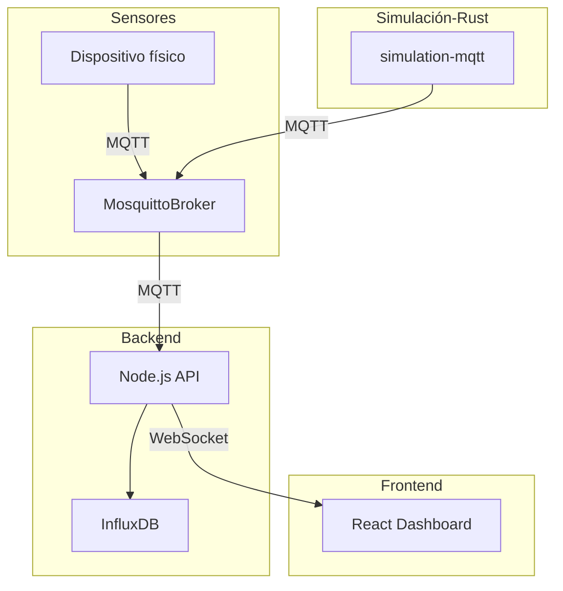

# IoT Sensor Dashboard

Este proyecto es un sistema completo de monitoreo de sensores IoT en tiempo real, diseñado como un panel de control moderno. Utiliza MQTT para comunicación entre sensores y backend, almacena datos en una base de datos de series temporales (InfluxDB), y los visualiza en tiempo real a través de un frontend en React. Todo el sistema está orquestado con Docker.

---

## 🧱 Arquitectura

Componentes:
Mosquitto: Broker MQTT ligero y eficiente.

Node.js: Backend que escucha datos MQTT, los procesa y guarda en InfluxDB.

InfluxDB: Base de datos de series temporales ideal para datos de sensores.

React: Interfaz que se comunica vía WebSockets para mostrar los datos en tiempo real.

simulation-mqtt (Rust): Aplicación de simulación de sensores para pruebas.

## 🚀 Funcionalidades actuales

- Recepción de datos en tiempo real vía MQTT
- Persistencia en InfluxDB
- Dashboard con gráficos en vivo
- Orquestación vía Docker
- Simulación de sensores con Rust

## 📈 Funcionalidades futuras

- Alerta de umbrales por sensor
- Envío de comandos a actuadores (MQTT bidireccional)
- Visualización histórica y exportación CSV
- Sistema de usuarios y permisos
- Módulos predictivos con IA ligera
- Personalización de dashboards por usuario
- Mapas o planos con sensores geolocalizados
- Notificaciones (Telegram, Email, toast)
